# Nerd News

Nerd News is a website designed for people who are interested in Gaming and gaming related Tech. 

The website will provide a place for news posts to be created and discussed by users of the site. Users are able to create and post their own news/discussion posts in order to begin a discussion on the subject.
Users can then comment on these posts and form a discussion. Users will be able to Upvote / Downvote comments in order to move the best comments to the top of the comment section.

Visit the deployed site [here]()

## Table of Contents

## User Experience (UX)

### Strategy

#### Project Goals

The Website Should Feature:

- Responsive Design so that the site is usable on all screen sizes.

- A simple colour scheme to keep the site looking modern and to not distract from the content.

- The structure is simple and site navigation is intuitive.

- Site users are able to register an account in order to interact with the content.

- Site users are able to upvote or downvote comments in order to move more appropriate comments to the top of the comment section.

#### User Goals

- As the Site Admin, I want to be able to manage all content on the site.

- As a Site User, I want to be able to interact with the content

- As a Site user, I want the content to be easy to read and understand.

- As a Site User, I want to be able to navigate the site in an intuitive way.

- As a Site User, I want to be able to create my own posts and comments.

- As a Site user, I want to be able to correct any mistakes I make in posts / comments.

#### Strategy Table

Feature | Importance | Vability / Feasability
--- | --- | --- 
Responsive design | 5 | 5
Account registration | 5 | 5
Social Media signup | 2 | 2
Create, edit and delete news posts | 5 | 4
Create, edit and delete comments | 5 | 4
Upvote / downvote comments | 4 | 3
Abiity to add profile picture | 3 | 2
Change Homepage view (most recent / most active) | 3 | 2

### Scope

After Creating the strategy table, it is clear that the project should be released in multiple phases. The first phase will include all features required to build a minimal viable product. Any remaining planned features will be released in later phases.

#### First Phase

- Responsive Design

- Account Registration

- Create, edit and delete news posts

- Create, edit and delete comments

- Upvote / Downvote comments

#### Second Phase

- Social media signup

- Ability to add profile pictures

- Change homepage view

#### User Stories

Github Projects was used as my project management to track user stories. Using a Kanban board help me to focus on which tasks i should be working on and keep track of the projects progress.

#### Start

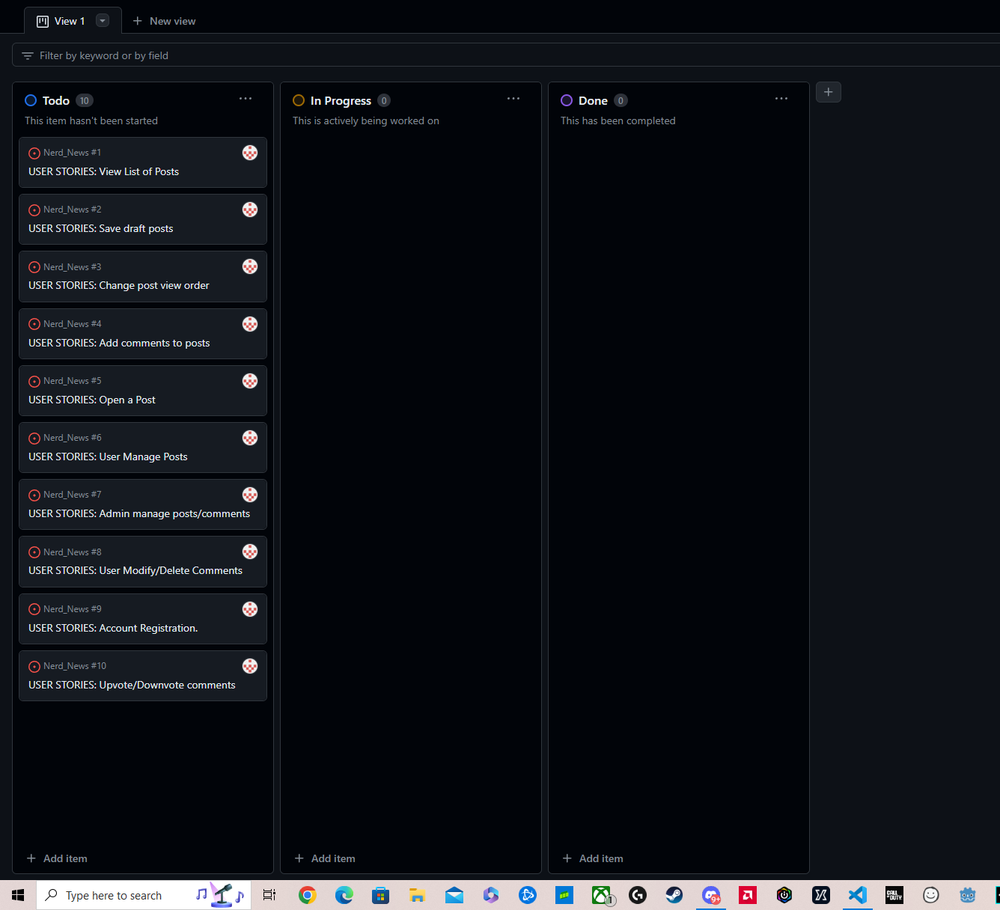

### Structure
I decided to organise the website in a Heirarchial Tree Structure. This it to encourage the user to navigate through the site in an efficient and intuitive way. Below you can find the website user navigation flowchart.

[Lucidchart](https://lucid.app/) Was used to create this flowchart.

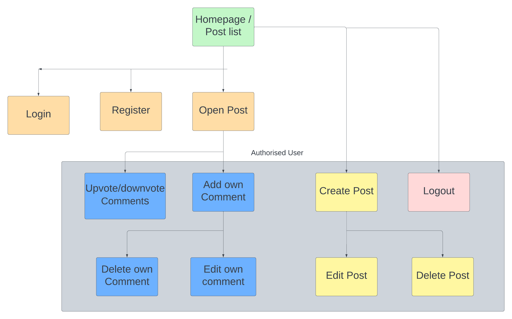

- Header, footer and navigation bar are featured on all pages.

- Links and forms provide feedback to the user.

- The ability to interact with the site content is provided when the site user registers an account.

- An error 404 page should be available.

#### Database Model

Below is a Database flow diagram that displays the connections between different parts of the database and how information is being passed between them. The database is being managed using [PostgreSQL](https://www.postgresql.org/)

The flow diagram was created using [DrawSQL](https://drawsql.app/)

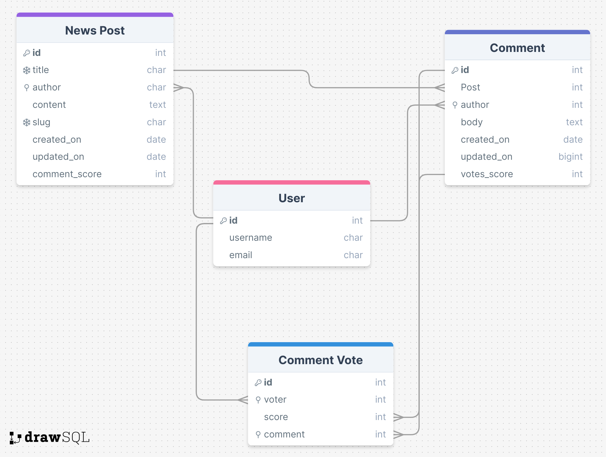

#### News Post Model

- Title: Unique news post title provided by the author.

- Author: Created from the post creators ID and stored as a foreighn key.

- Content: News Post content provided by the user.

- Slug: created from the news post title and saved as a unique key to identify the post by.

- Created on: Date and time set automatically when the question is created.

- Comment Score: Sum of amount of comments on the post. To be used for ability to filter homepage to "most active"

#### Comment Model

- Post: A foreign key that has been stored from the News Post model. Now stored to identify the post being commented on.

- Author: Author of the comment being stored as a foreign key.

- Body: Content of the comment supplied by the user

- Created on: Date and time set automatically when the comment is created.

- Votes Score: Calculated score of the sum of the comments Up / Downvotes.

#### Comment Vote Model

- Voter: User that is voting on the comment being stored as a foreign key.

- Score: Score of the Vote, Up being +1 and Down being -1

- Comment: Foreign key from the comment model now being used to identify the comment being voted on. stored as a foriegn key.

### Skeleton

#### Wireframes

[Balsamiq](https://balsamiq.com/) was used to show the planning of the appearance of the site. Also displaying the diferent elements and pages.

Site Element | Desktop View | Mobile View
--- | --- | ---
Index / User Logged Out |  | 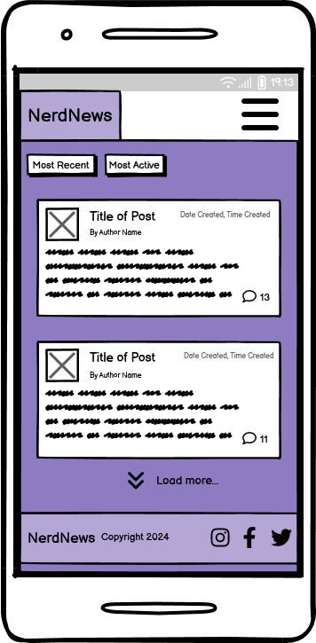
Index / User Logged In | 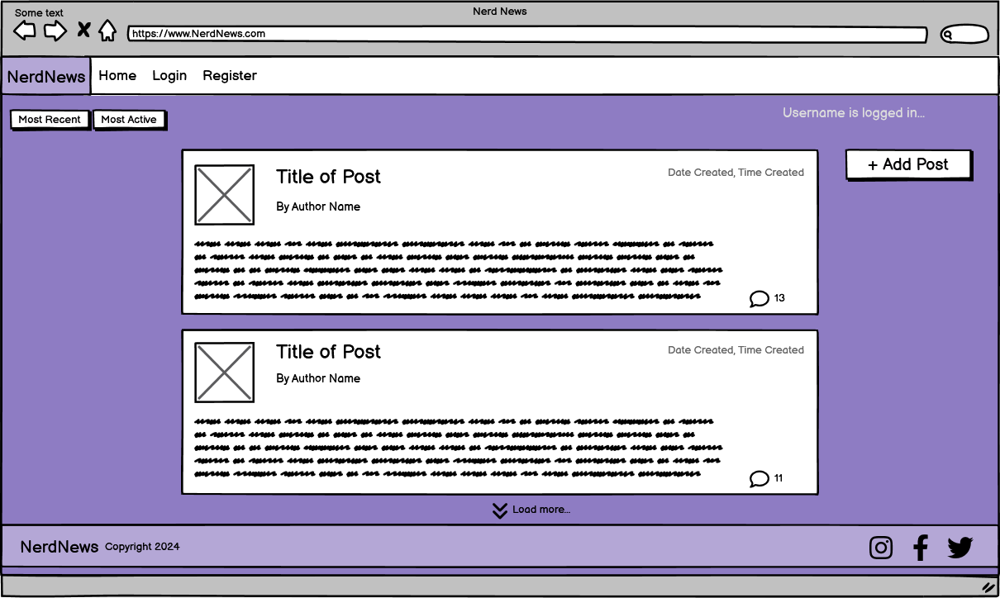 | 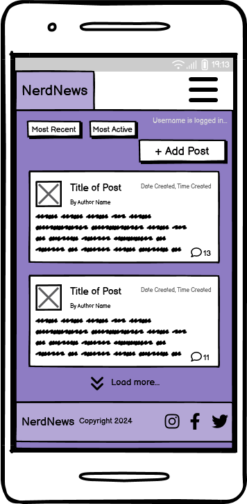
Register Page | 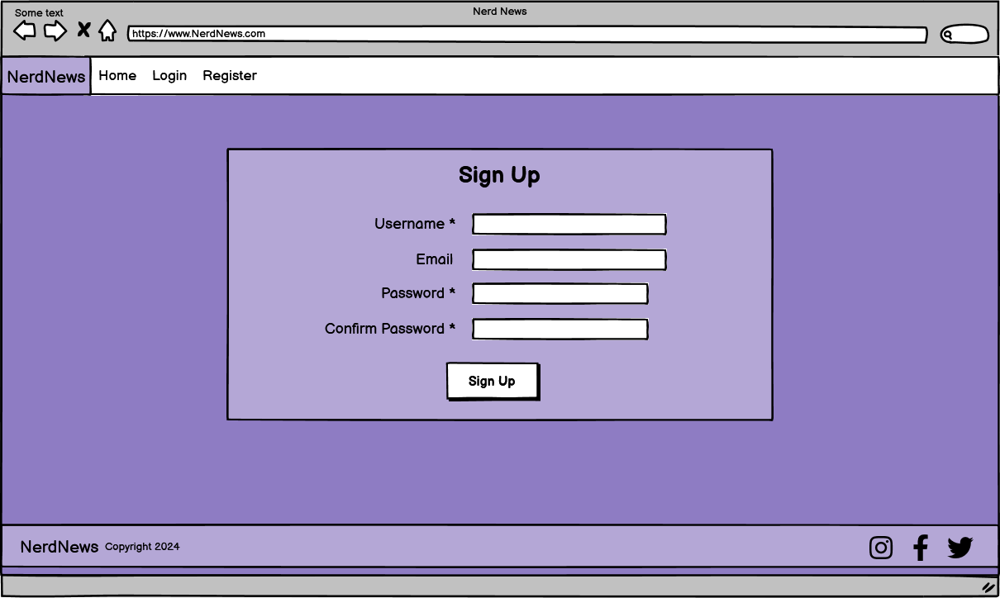 | 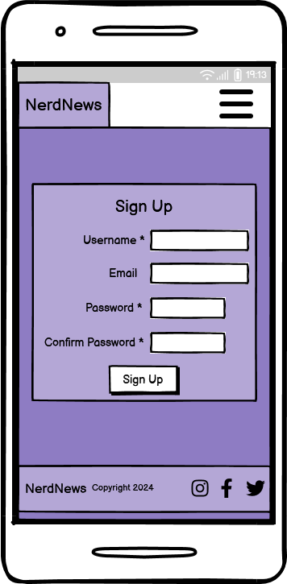
Login Page | 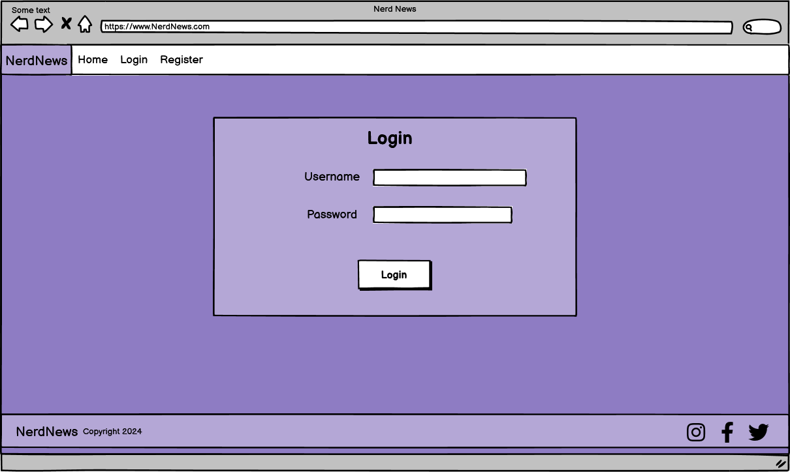 | 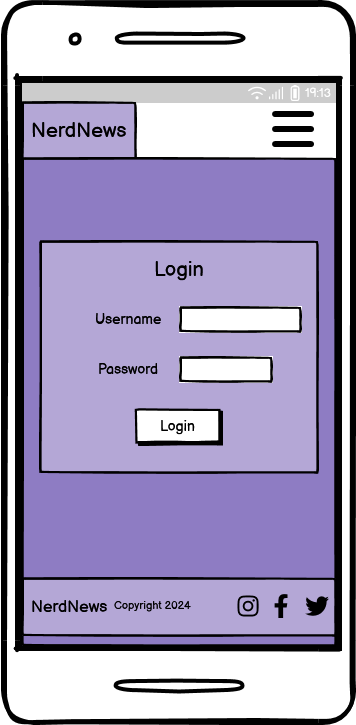
Open Post / Top of page | 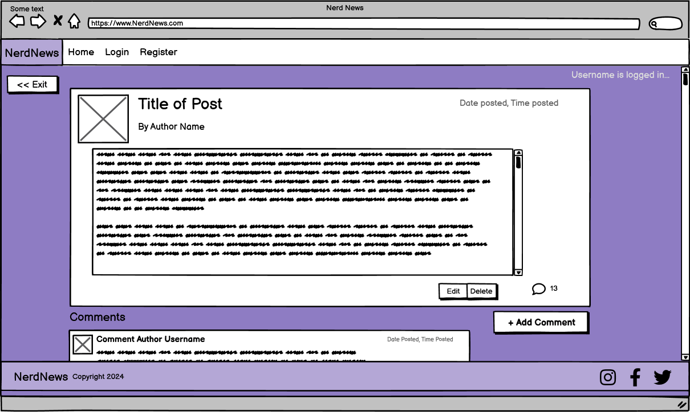 | 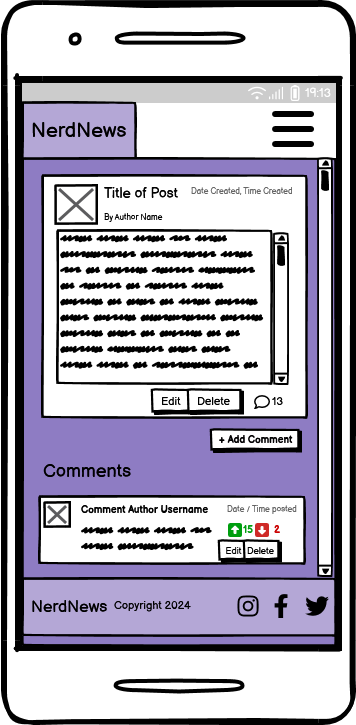
Open Post / Comment Section | 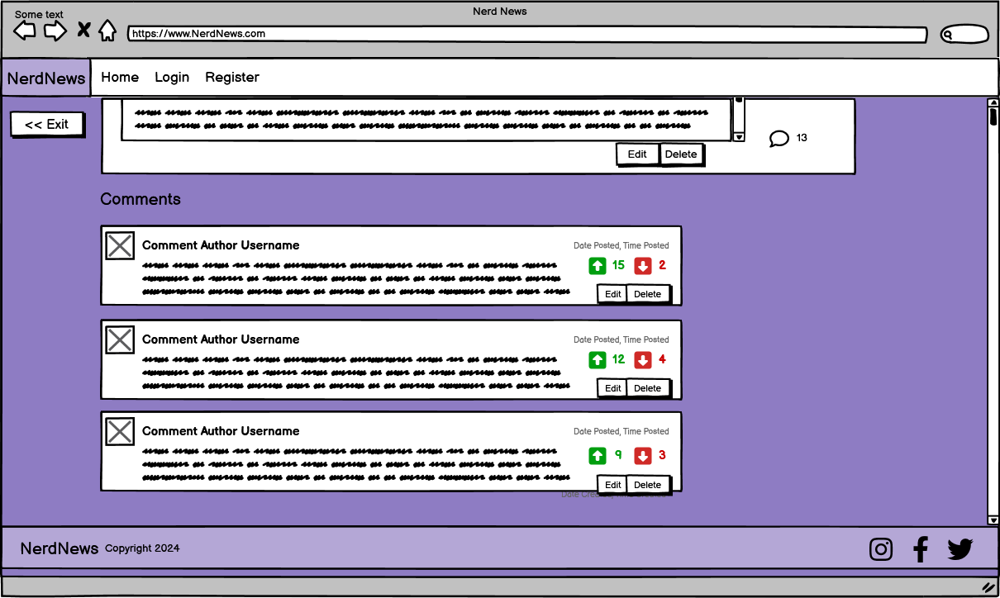 | 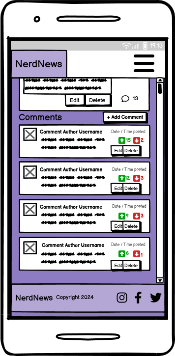
Add Post |  | 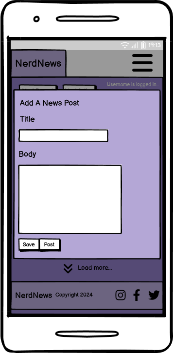
Add Comment | 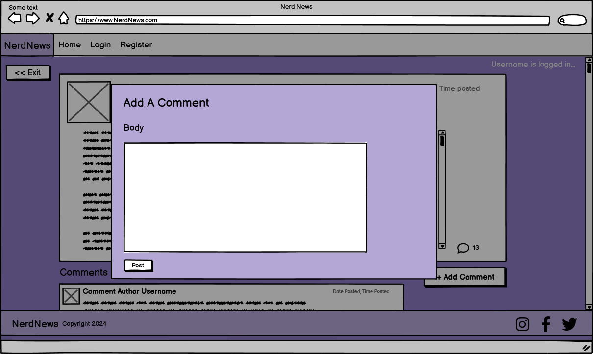 | 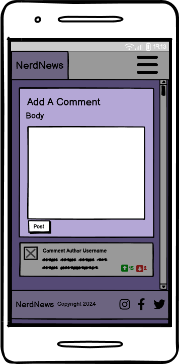
Edit Comment | 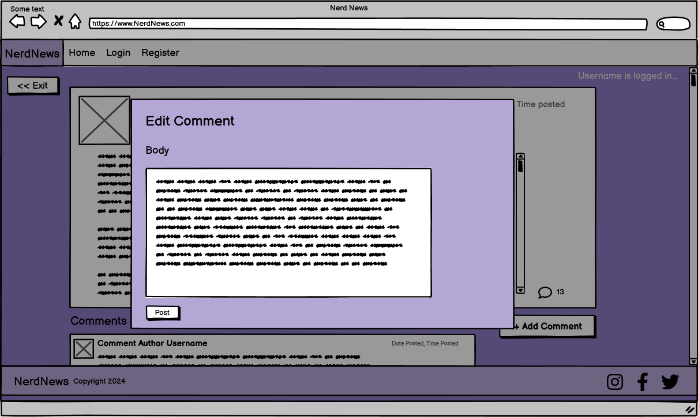 | 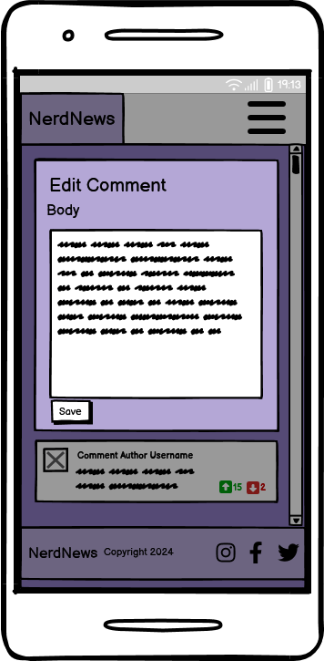
Delete Comment / Post | 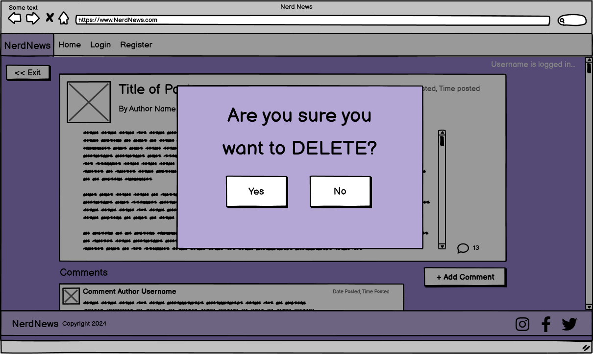 | 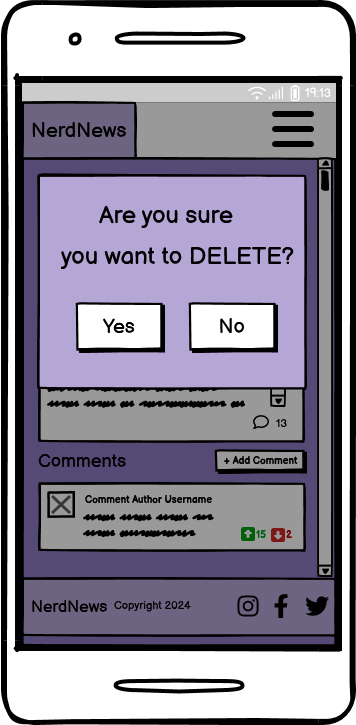