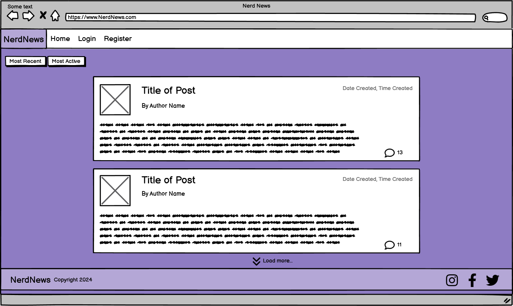

### Structure
I decided to organise the website in a Heirarchial Tree Structure. This it to encourage the user to navigate through the site in an efficient and intuitive way. Below you can find the website user navigation flowchart.

[Lucidchart](https://lucid.app/) Was used to create this flowchart

#### Wirefames

[Balsamiq](https://balsamiq.com/) was used to show the planning of the appearance of the site. Also displaying the diferent elements and pages.

Site Element | Desktop View | Mobile View
--- | --- | ---
Index / User Logged Out |  | 
Index / User Logged In |  | 
Register Page |  | 
Login Page |  | 
Open Post / Top of page |  | 
Open Post / Comment Section |  | 
Add Post |  | 
Add Comment |  | 
Edit Comment |  | 
Delete Comment / Post |  | 